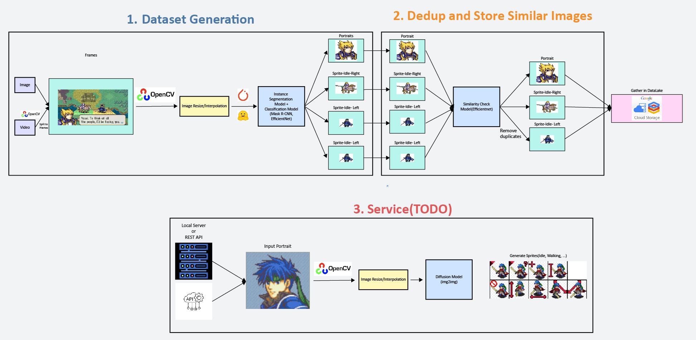

# Instance Segmentation + GAN Model for Generating 2D Sprites Based on Character Portraits

## Structure



1. We make an instance segmentation model that will collect character portraits and 2D sprites to speed up data collection process.
2. img2img model to generate 2D sprites from character portraits. Start with `idle-downward` generation, and then expand to creating whole set of sprites.

## Start

```sh
python -m venv venv

# windows powershell
$ . venv/Scripts/activate

# macOS/Linux
$ . venv/bin/activate


# setup environment
$ pip install -e .

# start label studio
$ label-studio start

# split YOLO
python -m scripts.split_yolo_exported_files --input-dir .\data\instance_segmentation_yolo --output-dir .\data\instance_segmentation_yolo
```
